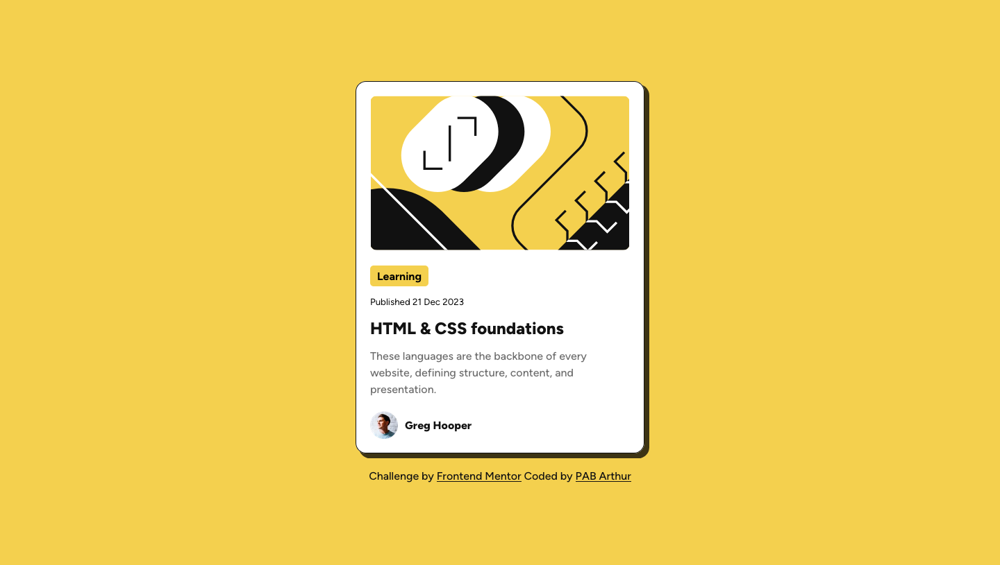

# Frontend Mentor - Blog preview card solution

This is a solution to the [Blog preview card challenge on Frontend Mentor](https://www.frontendmentor.io/challenges/blog-preview-card-ckPaj01IcS). Frontend Mentor challenges help you improve your coding skills by building realistic projects.

## Table of contents

- [Overview](#overview)
  - [The challenge](#the-challenge)
  - [Screenshot](#screenshot)
  - [Links](#links)
- [My process](#my-process)
  - [Built with](#built-with)
  - [What I learned](#what-i-learned)
  - [Continued development](#continued-development)
  - [Useful resources](#useful-resources)
- [Author](#author)
- [Acknowledgments](#acknowledgments)

## Overview

### The challenge

Users should be able to:

- See hover and focus states for all interactive elements on the page

### Screenshot



### Links

- Live Site URL: [View live site](https://glistening-hamster-45ba50.netlify.app/)

## My process

### Built with

- Semantic HTML5 markup
- CSS custom properties
- Flexbox
- Mobile-first workflow

### What I learned

During this project, I focused on structuring semantic HTML and organizing CSS for better readability and maintainability. Here are some highlights:

- Grouped related elements (e.g., ``, `<span>`, `<small>`) inside `<div>` containers for better structure and styling.
- Used descriptive class names like `card-header`, `card-content`, `wrapper`, `card-title`, and `card-description` to improve code readability.
- Improved accessibility by adding meaningful `alt` attributes to images, such as:
  ```html
  
  ```

### Continued development

In future projects, I want to focus on:

- Exploring advanced CSS techniques, such as CSS Grid, for more complex layouts.
- Improving responsiveness to ensure designs look great on a wider range of devices and screen sizes.
- Experimenting with animations and transitions to enhance user experience.

### Useful resources

- [A More Modern CSS Reset](https://piccalil.li/blog/a-more-modern-css-reset/) - This resource helped me understand and implement a modern CSS reset, ensuring consistent styling across different browsers. I found it particularly useful for improving the base styles of my project.

## Author

- Frontend Mentor - [@pabjunior](https://www.frontendmentor.io/profile/pabjunior)

## Acknowledgments

I would like to thank [Frontend Mentor](https://www.frontendmentor.io/) for providing this challenge, which helped me improve my HTML and CSS skills.
